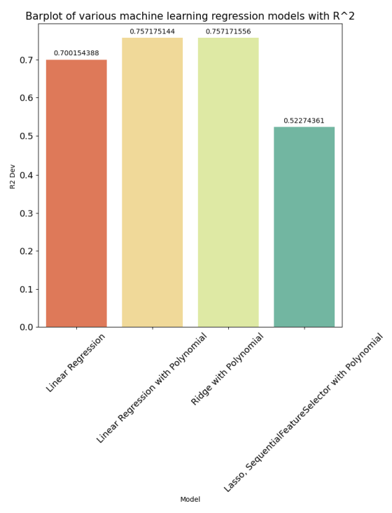
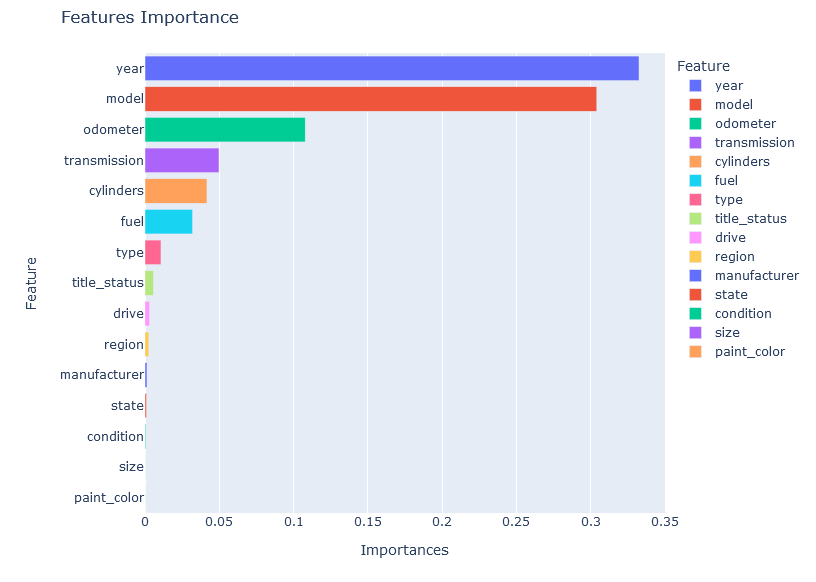

# What Drives the Price of a Car

### Overview: ###

In this application, you will explore a dataset from kaggle. The original dataset contained information on 3 million used cars. To frame the task, throughout these practical applications we will refer back to a standard process in industry for data projects called CRISP-DM

### Data: ###

The data can be found in this repository.

[Vehicles.csv](https://github.com/camorante/What-Drives-the-Price-of-a-Car-/blob/main/data/vehicles.csv)

### Business Understanding: ###

In the following lines we are going to analyze the dataset data in order to define the quality of the data and verify that we need to be able to use it reliably in a complete model.

#### Findings: ####

<ins>Features Null Percentage</ins>

Many of the numeric columns can be replaced with an average (such as the year) and some of the categorical columns, such as transmission, can be replaced with the most frequent value, below is a column by column analysis.

**id**: we can use this column as an index or we can drop this column, i choose drop it

**price**: target variable, some prices have a value of 0, these zeros will be replaced by the mean.

**state**: categorical variable without null values

**region**: categorical variable without null values.

**year**: we can reeplace values using the most frequently value

**transmission**: we can reeplace values using the most frequently value

**fuel**: we can reeplace values using the most frequently value

**odometer**: we can average the values of all vehicles and assign this mean to the null values

**model**: This feature has too many categorical values, the idea here is to eliminate the null values once we have imputed the rest of the features. I will look for a way to minimize the number of categories.

**title_status**: we can reeplace values using the most frequently value

**manufacturer**: This column has a significant amount of null values, but I think it is possible to use the most frequently used value

**type**: This column is important but has almost 22% of null values, we can reeplace values using the most frequently value

**paint_color**: we can reeplace values using the most frequently value

**drive**: This column is important but has almost 30% of null values, we will apply the most frequent value as long as it does not exceed 50% of null values

**VIN**: this column is a unique identifier and can be dropped

**condition**: we will apply the most frequent value

**cylinders**: First at all it is possible to convert this column to numerical. Second, approximately 41% of the values are null, almost 50%. I will take the risk to impute them with the most frequent value

**size**: size is a value that has almost no useful values since the nulls represent 71% (> 50% null values) of the total dataset, this column should be dropped. but we will wait later if after processing the data and eliminating duplicates it is not necessary.

There are some records that are not really worth saving and they are all those that only have the price of the vehicle and no other data (except for the state and region), these data will be removed from the datset.

<ins>Target Variable Logarithm</ins>

As we can see our target variable is somewhat skewed so we will proceed to apply a logarithmic transformation method later on if required.

### Data Preparation: ###

Once we have identified the problems in the dataset we proceed to correct them in order to have good quality data.

#### Cleaning: ####

Many data were imputed with the most frequent value. In the case of the odometer it is possible to use an average to fill in null values. 

Many duplicate values were removed. Approximately 13% of the values were duplicated after all null values remaining after imputations were removed.

Outliers with very high values were removed using the zscore method and maximum and minimum values using IQR.

With respect to the model features, within the dataset there are many categories that have names with unnecessarily long texts, what was done was to cut those names in order to reduce the number of similar categories, for them if a category had one or two words it was left as it was, but if it had more than two only the first two words were left. In addition, categories with a count of less than 50 records were removed.

#### Correlations: ####

<ins>Correlations HeatMap</ins>

<ins>Correlations Pair Plot</ins>

<ins>Price Correlations</ins>

As we can see there are several correlations between features that are very striking among them:

* The positive correlation between price and model is quite high indicating that a change in model is highly correlated with a change in price.
* The negative correlation between odometer and price indicates that the price goes down if the odometer is very high and vice versa, which is somewhat natural since it is an indication that the more the vehicle has been driven, the lower its value.
* There is a negative correlation between the odometer and the transmission, indicating that with a higher odometer the transmission will have more use and therefore its value and contribution to the cost of the vehicle has to go down.
* There is a positive correlation between region and state, since both are locations, it is natural to find such a relationship.

### Modeling: ###

Once we have our data ready, we proceed to search for the best model, using Ridge, Lasso, LinearRegression and GridSearch to find the best possible model. I will use k-fold Cross validation.

For the training I used 4 different models in order to find the most optimal one:
* Simple Linear Regression
* Simple Linear Regression with Polynomial
* Ridge with Polynomial
* Lasso, SequentialFeatureSelector with Polynomial

<ins>Real vs Predictions</ins>

### Evaluation: ###

#### Error Evaluation: ####

We proceed to evaluate our model to verify if it is really good at making predictions.

I have two types of results, one with my target variable normalized with the np.log function and one without converting.

<ins>With Linear Data</ins>

<ins>With Non-Linear Transformation</ins>

I used MSE and R2 as I am more interested in penalizing large errors in my model in order for my metric to reflect the true accuracy of my model.
For this search I tried using a logarithmic and non-logarithmic target variable and obtained the following results:

'Simple Linear Regression with Polynomial' and 'Ridge with Polynomial' were the best scoring models followed by the 'Simple Linear Regression' model and 'Lasso' in last place. All these calculations were done for both logarithmic and non-logarithmic target variables. The interesting thing about the results is that my error was much lower using a non-logarithmic target variable, This suggests that my model with unconverted target variable is better at predicting on unseen data.

#### Feature Weight: ####

Here we look for which characteristics have a considerable weight in the price calculation, for that we will use permutation importance

<ins>Features Importances</ins>

<ins>Coefficients</ins>

In the search for weights for each of the characteristics I found that the year, model, odometer, transmission and cylinders of the vehicle have a very large influence on the prediction of the values, while the color, size and condition are not so decisive when calculating the price of the vehicles. In addition, we can see that the coefficients of a model with one of the best scores  (Ridge with Polynomial) have marked extremes where the year and model and the combination of year-odometer and year-cylinders predominate, giving us an indication of the weight that these characteristics have at the time of predicting the price.

### Deployment: ###

#### Client Report: ####

Dear client, thank you for hiring my services, in my quest to improve the services you offer I would like to give you a report that shows how you could improve your sales and allow you to increase your profits. 

For this I will start a detailed analysis analyzing the most important variables so you know how to improve your business.

First of all, in my analysis I found that features such as year, model, odometer, cylinders and transmission are very important when pricing your vehicles, so I will show you which are the best features for your business and knowing them you can make good decisions for the future. This is valuable piece of information I would like you to keep in mind.

Second, the analysis and results presented are a guide and at no time are they an absolute truth, my intention is that these numbers serve as a guide in the best decisions for your business.

<ins>Average Car Price by Year</ins>

Let's start with the year and the average price of each of the years analyzed, as you can see the cars between the years 1900 and 1970 (omitting the war period of the second world war and 5 years after) tend to have quite high prices compared to subsequent years, especially the years 1900 and 1933, I recommend you to negotiate with that kind of cars. For the years between 2011 onwards there is also an interesting price increase, but mostly it is due to the fact that these cars increase in price because they have a lower odometer the newer the vehicle is.

<ins>Average Car Price by Model</ins>

In this chart I show you the top 15 models of vehicles that have the highest average price, among these we find Audi's Q8 or BMW's M4, also trucks like the Ford f-150 and GMC's Sierra 1500. The first vehicles on the list are high-end vehicles that have high prices so they may not have as fast an exit as vehicles with more affordable prices.

<ins>Average Car Price by Manufacturer</ins>

The average selling price by brand can be seen in this graph, as you can see the highest prices correspond to high-end vehicles such as Tesla, Jaguar, Porsche and others, while the most economical vehicles belong to brands such as Kia, Hyundai, Honda and others. This graph will allow you to have a higher vision of which vehicles to sell in case you specialize in the high, medium or low range segment.

<ins>Average Car Price by Transmission</ins>

Manual transmissions are usually cheaper than automatic transmissions, here you can see the average selling price of a vehicle with automatic vs. manual transmission. Automatic transmissions have a higher price per vehicle due to their greater complexity, so this chart will help you decide if it is more profitable to sell vehicles with manual or automatic transmissions, or a balance of both.

<ins>Average Car Price by Odometer Range</ins>

The odometer section is interesting because as you know the more mileage a vehicle has the more it tends to devalue, unless they are classic cars which we were able to check the prices in a previous graph.  In general, the more mileage a vehicle has the lower its selling price, with the exception of some classic cars. As you can see, the most expensive vehicles are the 0 mileage vehicles.

<ins>Average Car Price by Cylinders</ins>

Vehicles with 8 cylinders tend to have a higher average price than the others, they are likely to be more desirable because of their power-consumption ratio, so as demand increases, the price is likely to rise. 

<ins>Average Car Price by State</ins>

Finally I would like to show you a graph with the average selling price in each of the states of the USA (it is not a feature with great influence on the price of the vehicle but it is interesting), it is an interesting data because it can be a determining factor when investing and creating a new business and this information will help you to decide the place where you could start a new business or headquarters. 

West Virginia stands out as the state with the highest sales prices and Rhode Island has the lowest average prices. Deciding on one or the other depends on many factors and not only the price, but you should also include taxes, salaries and fixed costs, but this will give you a small glimpse of what is going on and allow you to make valuable decisions.

#### Conclusions: ####

1. The year of manufacture of the vehicle is very influential in the prediction of the price, the model also presents the same behavior.
2. The odometer is diametrically opposed to the price, the more distance traveled, the lower the value of the vehicle, with the exception of classic cars.
3. In spite of what it may seem the color of the vehicle, the condition and the size does not influence the price prediction as much.
4. There are some states where prices are higher, this is probably due to several factors such as taxes, salaries, preference for certain brands among others.
